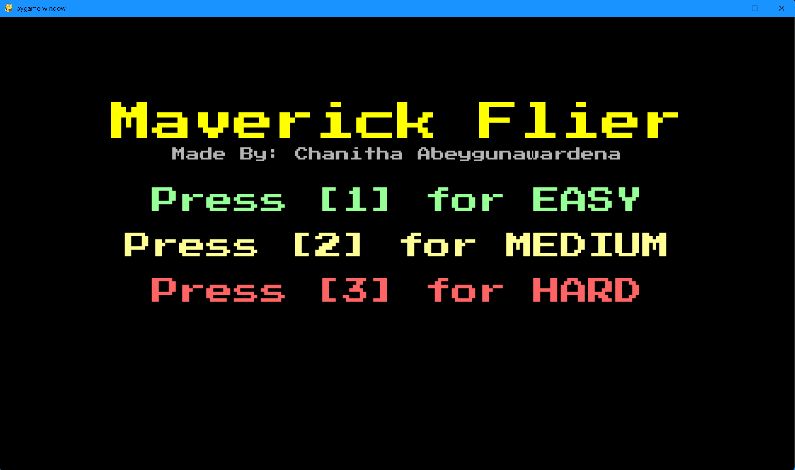
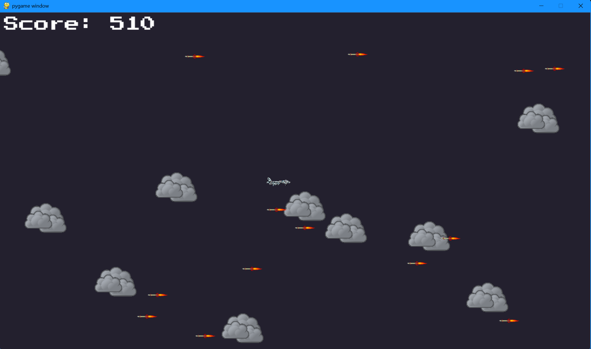
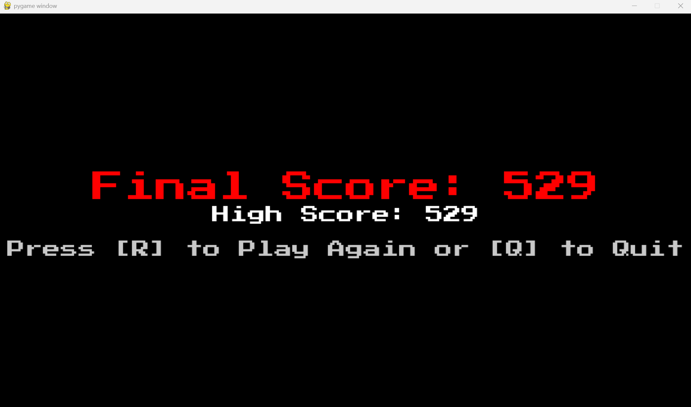

# TopGun Infinite

Using Python and Pygame, TopGun Infinite is a light 2D aerial shooter. Pilot your jet, avoid missiles, and stay alive for as long as you can. The game has different levels of difficulty, simple graphics, sound effects, and a way to keep track of high scores.

## Features
- Interarctive and engaging retro UI/UX
- Three levels of difficulty: Easy, Medium, and Hard
- Use the arrow keys to move the jet around.
- Enemies that shoot missiles at you faster as you level up; clouds for depth;
- Retro Visual and Sound FX
- Saved high score
- Screen that says "Game Over" with a restart option

## Getting Started
### Prerequisites
Make sure you have Python installed. Python 3.6 or later is best.

Install the required libraries:

```bash
pip install -r requirements.txt
```

### Run the game

```bash
python main.py
```
> The game should be run in the terminal

> Make sure the `assets/` folder is in the same directory and contains all images and audio files.

## Tech Stack
- Python 3
- Pygame

## Screenshots

### Main Menu


### Gameplay


### Game Over



## Made By
Chanitha Abeygunawardena

